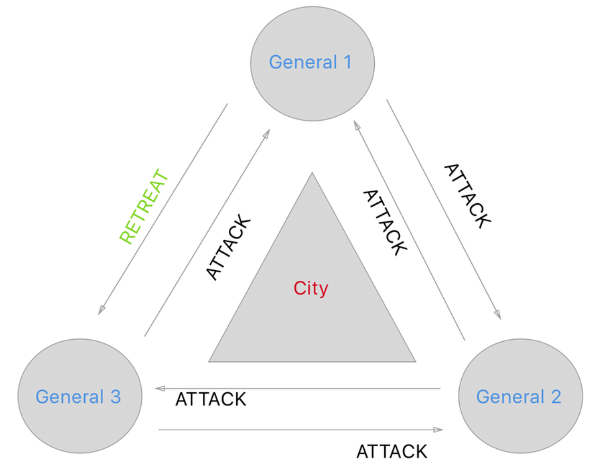
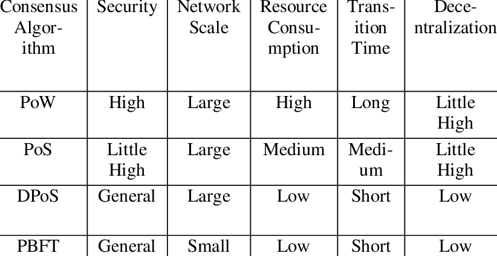
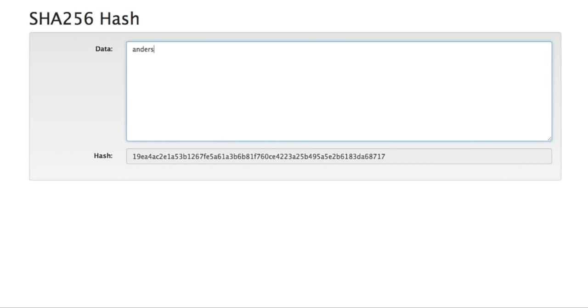
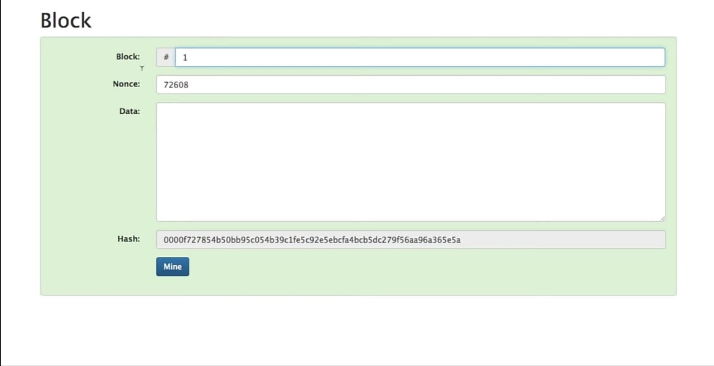
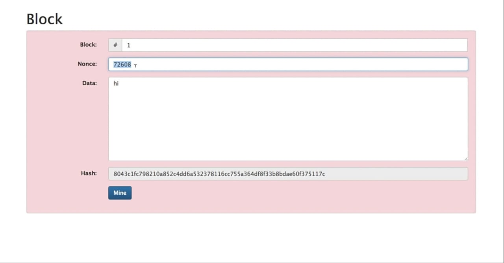
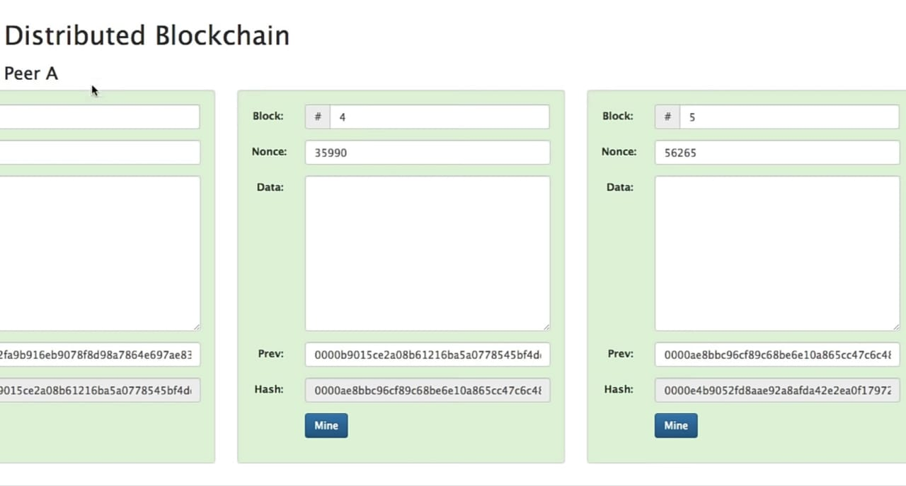
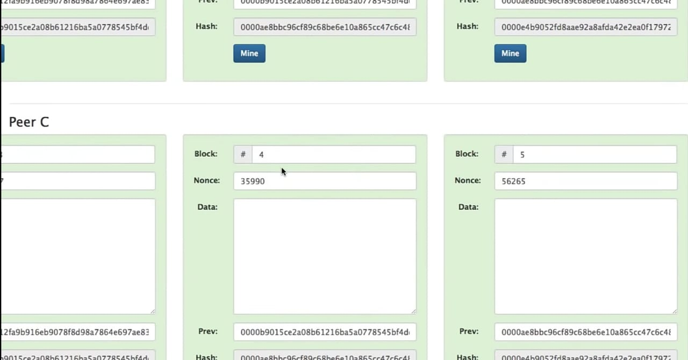
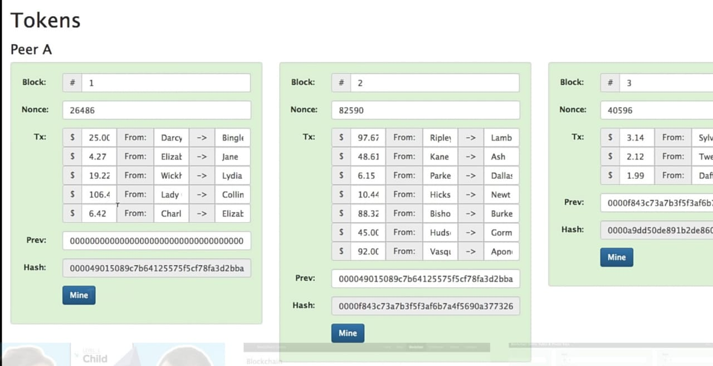
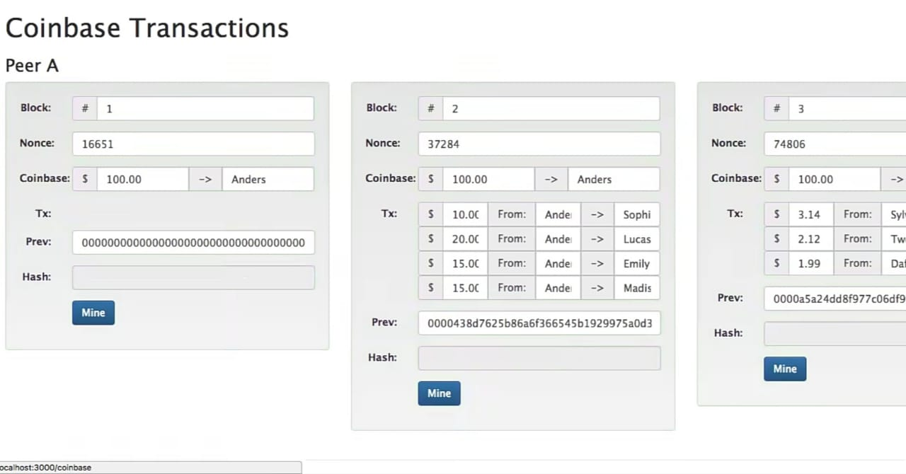
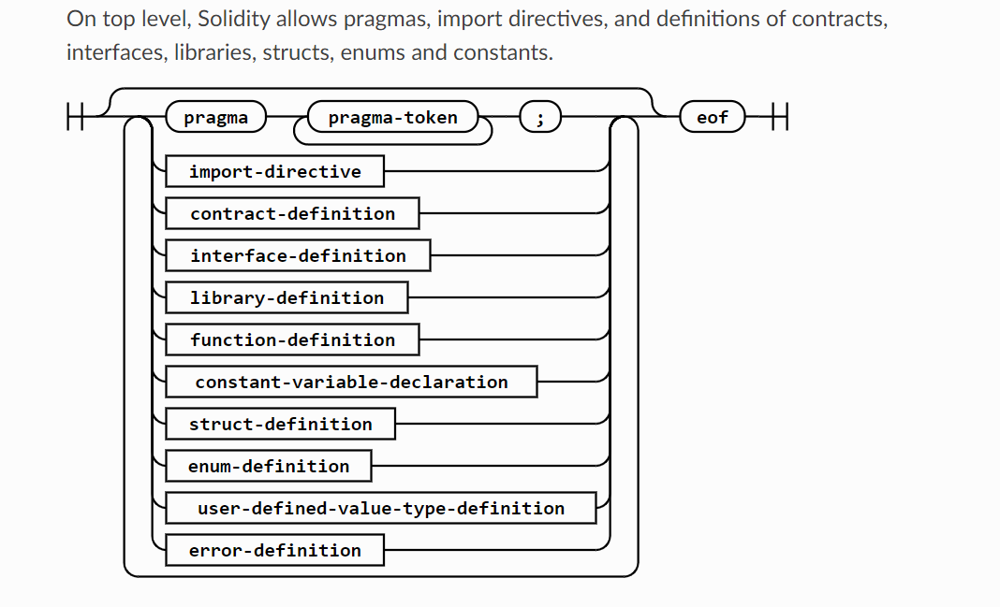

## 1. What is Blockchain ?
Blockchain ia a system of recording information in a way that makes it difficut or impossible to change , hack or cheat the system. a blockchain is essentially a digital ledger of transactions that is duplicated and distributed across the entire network of computer system on the blockchain.

## 2. Why do we need Blockchain ?
Blockchain helps in the verification and traceability of multistep transactions needing verification and traceability. it can provide secure transaction , reduce compliance costs , and speed up data transfer processing, blockchain technology can help contract managment and audit the origin of a product.

### i) Byzantine generals

the byzantine generals problem is a game theory , which describes the difficulty decentralized parties have in arriving at consensus without relying on a trusted central party. in a network where no member can verify the identity of other members, how can members ,  how can members collectively agree on a certain truth.




## 3. What is Consensus ? 

It is basically the agreement on a single data value or a single state of the network among distributed processes or multi-agent .

## 4. What are Consensus Algorithms ?
1. POW
2. POS
3. DPOS,DPS



###  i) POW
The algorithm is used to confirm the transaction secure and creates a new block to chain . in this algorithm minors (group of peoples) compete the transaction on the network. as soon valid block created by the minors it get into the ledger

### ii) POS
A Proof of Stake (PoS) consensus algorithm is a set of rules governing a blockchain network and the creation of its native coin, that is, it has the same objective as a Proof of Work (PoW) algorithm in the sense that it is an instrument to achieve consensus. Unlike PoW, there are no miners involved in the process.

### iii) DPOS
Delegated Proof of Stake (DPoS) is a consensus algorithm developed to secure a blockchain by ensuring representation of transactions within it. DPoS is designed as an implementation of technology-based democracy, using voting and election process to protect blockchain from centralization and malicious usage.

## 5. What Are the KEY Differences Between BTC and ETH? 
1. Supply Limiting. While BTC has a fixed supply of 21 million coins, ETH has a current supply of around 107 million...
2. Acceptability. BTC can be spent in many more places than ETH. BTC is accepted by 36% of small-to-medium businesses in...
3. Global functionality. In addition to being accepted in many places, BTC has begun to serve as national legal tender,...
4. Technology. ETH and BTC rely on different kinds of blockchain technology. ETH uses its own Proof-of-Work...


## 6. What Are the KEY Differences Between Polygon and ETH? 
Ethereum is a much more decentralized blockchain than Polygon and thus more secure. Polygon intends to become a layer 2 solution where it would derive its security from Ethereum mainnet. Currently however, Polygon’s architecture is defined as a side chain.

## 7. List of Major Blockchains ?

### i) Terra ($LUNA)
Terra is a blockchain protocol that uses fiat-pegged stablecoins to power price-stable global payments systems. According to its white paper, Terra combines the price stability and wide adoption of fiat currencies with the censorship-resistance of Bitcoin (BTC) and offers fast and affordable settlements.

### ii) Solana
Solana has a healthy ecosystem, and its value as a blockchain in terms of how fast it is and how cheap it is to use compared to Ethereum will keep it extremely relevant in the near future.

### iii) Polygon
Polygon effectively transforms Ethereum into a full-fledged multi-chain system (aka Internet of Blockchains). This multi-chain system is akin to other ones such as Polkadot, Cosmos, Avalanche etc. with the advantages of Ethereum’s security, vibrant ecosystem and openness

### iv) Ethereum ($ETH)
Ethereum is a decentralized open-source blockchain system that features its own cryptocurrency, Ether. ETH works as a platform for numerous other cryptocurrencies, as well as for the execution of decentralized smart contracts.


## What are technologies used in Blockchain ?

Keywords -

### 1. Encryption and Decryption

Encryption is the process of converting normal message (plaintext) into meaningless message (Ciphertext). Whereas Decryption is the process of converting meaningless message (Ciphertext) into its original form (Plaintext).

```
from cryptography.fernet import Fernet
key = Fernet.generate_key()
print(key)
msg = "Welcome to Channel".encode()
f_obj = Fernet(key)
encrypted_msg = f_obj.encrypt(msg)
print(encryted_msg)
decryted_msg = f_obj.decrypt(encrpted_msg)
print(decryted_msg)

```

### 2. Brute force

In cryptography, a brute-force attack consists of an attacker submitting many passwords or passphrases with the hope of eventually guessing correctly. The attacker systematically checks all possible passwords and passphrases until the correct one is found. Alternatively, the attacker can attempt to guess the key which is typically created from the password using a key derivation function. This is known as an exhaustive key search.

### 3. Hashing (sha 256)

SHA-256 is a patented cryptographic hash function that outputs a value that is 256 bits long. What is hashing? In encryption, data is transformed into a secure format that is unreadable unless the recipient has a key. In its encrypted form, the data may be of unlimited size, often just as long as when unencrypted.

-keywords
1. search key
2. hash table 
3. hash function

## Tools and Technologies used in Blockchain development. 

0. Smart Contracts and evaluation tools - 
    -- Solidity (contracts)
    #### Solidity is an object-oriented programming language for writing smart contracts. It is used for implementing smart contracts on various blockchain platforms, most notably, Ethereum. ... The programs compiled by the Solidity are intended to be run on Ethereum Virtual Machine.

    -- Viper (contract)
    #### Virtual Incident Procurement (VIPR) is a web-based Forest Service application designed to administer preseason Incident Blanket Purchase Agreements (I-BPAs - formerly referred to as Emergency Equipment Rental Agreements or EERAs).

    -- Ganache (A local blockchain)
    #### Ganache is used for setting up a personal Ethereum Blockchain for testing your Solidity contracts. It provides more features when compared to Remix. ... Before you begin using Ganache, you must first download and install the Blockchain on your local machine.

1. Python
    -- web3.py
    #### Web3.py is a Python library for interacting with Ethereum. It's commonly found in decentralized apps (dapps) to help with sending transactions, interacting with smart contracts, reading block data, and a variety of other use cases.

    -- Brownie
    #### Brownie is a Python-based development and testing framework for smart contracts targeting the Ethereum Virtual Machine. All code starting with $ is meant to be run on your terminal. Code starting with >>> is meant to run inside the Brownie console.

2. Javascript

    -- Truffle
    #### Truffle is a development environment, testing framework and asset pipeline for Ethereum, aiming to make life as an Ethereum developer easier. With Truffle, you get: Built-in smart contract compilation, linking, deployment and binary management. ... Scriptable deployment & migrations framework

    -- Hardhat
    #### Hardhat is a development environment to compile, deploy, test, and debug your Ethereum software. Get Solidity stack traces & console. log. Actions. Packages

differences between the above technologies (eg, hardhat vs brownie, web3.py vs truffle, solidity vs viper)

## differences between truffle vs brownie ?

One such popular framework for writing dApps using the Solidity programming language is Truffle. Truffle provides a basic scaffolding to design dApp projects. Using Truffle, we can create the smart contracts required to create the blockchain functionality, write unit tests for the functions, and design the front-end design of the dApp.

Brownie is a Python-based development and testing framework for smart contracts targeting the Ethereum Virtual Machine.


## differences between web3.py vs hardhat ? 

Ape is a framework for Web3 Python applications and smart contracts, with advanced functionality for testing, deployment, and on-chain interactions.


Hardhat comes built-in with Hardhat Network, a local Ethereum network node designed for development, akin to Ganache, geth --dev, etc. It allows you to deploy your contracts, run your tests and debug your code. How does it work? It runs as either an in-process or stand-alone daemon, servicing JSON-RPC and WebSocket requests.


## differences between solidity vs viper ?

Solidity is a contract-oriented, high-level programming language for implementing smart contracts. Solidity is highly influenced by C++, Python and JavaScript and has been designed to target the Ethereum Virtual Machine (EVM). This tutorial targets novice developers and those new to Solidity.

Viper is a binary analysis and management framework. Its fundamental objective is to provide a solution to easily organize your collection of malware and exploit samples as well as your collection of scripts you created or found over the time to facilitate your daily research.

## What is Hash?



hash look like a bunch of random number essentially what it is it's a digital finger print if some digital data and it just so happens its a fingerprint of whatever you type in the box .


## What is Block?




it's exactly like a hash its just tha data section  i've  broken out now into three sections  one called block this is just some kind of a number 
like block no. 1 a nonce which is just yet another number will go into what that is in a second and then just some more data just very similarly to the way that we had it before however the hash of this which includes all of this information up here is down here and its begins with four zeros you see that is a relatively unsual has you know most of them are not really going to start wih four zeros like thats but this one happens to and because it does totally arbitrarily i'm going to say that this block is signed 

## What is Distribution?





## What is Tokens?

A cryptographic token represents rules on a blockchain. Smart Contracts encrypt them. Each token belongs to a blockchain address. With your wallet, you can use your token. That means, only if you have the private key for the address of the token, you can use it. The token makes you the owner.

money-transfer


A blockchain token can represent an asset. So if you want to hand over an asset on the blockchain, you only have to sign the token with your private key and send it to the other person. As a result, the ownership of the property has changed.

A token can also represent an access right. So you can get access by signing with your private key. For example, if you want to use software, you only need the token and sign the access with your private key.

## What is Coinbase?


invent money from eth and give it to someone

Coinbase is a secure online platform for buying, selling, transferring, and storing digital currency. Our mission is to create an open financial system for the world and to be the leading global brand for helping people convert digital currency into and out of their local currency.

We make buying and selling digital currency easy.

Sending or receiving digital currency between online wallets, friends, or merchants on Coinbase is free!*

We handle security and backups so you don't have to worry.

We are a "one stop shop" - we offer a wallet, an exchange, and merchant tools within one simple interface.

Coinbase is a platform on which many applications are being built using our API.


#  Solidity (Smart-Contract)

## basic terminologies

### State Variables 

state varisble are variables whose values are permanently stored in contract storage.

1. uint (unassigned integer)
2. uint256
3. int
4. bool
5. address
6. string
7. const

### functions 

function are the executable unit of code function are usually defined inside a contract but they can also be defined outside of  contracts


    pragma solidity ^0.6.0;


    contract simpleaction{
       function bid(){

       }
      }
    
     }


### function modifiers 

Function modifiers can be used to amend the semantics of functions in a declarative way (see Function Modifiers in the contracts section).

1. pure
 for functions: Disallows modification or access of state.

2. view
 for functions: Disallows modification of state.

3. payable 
for functions: Allows them to receive Ether together with a call.

4. constant
 for state variables: Disallows assignment (except initialisation), does not occupy storage slot.

5. immutable
 for state variables: Allows exactly one assignment at construction time and is constant afterwards. Is stored in code.

6. anonymous 
for events: Does not store event signature as topic.

7. indexed
 for event parameters: Stores the parameter as topic.

8. virtual 
for functions and modifiers: Allows the function’s or modifier’s behaviour to be changed in derived contracts.

9. override
 States that this function, modifier or public state variable changes the behaviour of a function or modifier in a base contract.


## Events

Events are convenience interfaces with the EVM logging facilities.

## Errors

Errors allow you to define descriptive names and data for failure situations. Errors can be used in revert statements. In comparison to string descriptions, errors are much cheaper and allow you to encode additional data. You can use NatSpec to describe the error to the user.

## Struct Types (like js object)


Structs are custom defined types that can group several variables (see Structs in types section).


          // SPDX-License-Identifier: GPL-3.0
           pragma solidity >=0.4.0 <0.9.0;

        contract blockchain {
        struct Voter { 
        uint FavoriteNo;
        bool Yes/No;
        address Address;
        uint Number;
    }
    }

## Enum Types (like an array)
Enums can be used to create custom types with a finite set of ‘constant values’ (see Enums in types section).


     // SPDX-License-Identifier: GPL-3.0
     pragma solidity >=0.4.0 <0.9.0;
     
     contract Purchase {
         enum State { Created, Locked, Inactive } // Enum
     }


## Solidity first contract (remix)



    pragma solidity ^0.6.0;

    contract SimpleStorage {
   
    uint256 favoriteNumber;

      function store(uint256 _favoriteNumber) public {
        favoriteNumber = _favoriteNumber;
     }
    
    struct People {
     uint256 name;
     string class;
    }

    // People public person = People({name: 2, class: "hello"});

     People[] public people;
     mapping(string => uint256) public classToname;
    // People[2] public person;

    function addPerson(string memory _name, uint256 _favoriteNumber) public{
        people.push(People(_favoriteNumber, _name));
        classToname[_name] = _favoriteNumber;
    }

    //view = reading , pure = reading

    }

